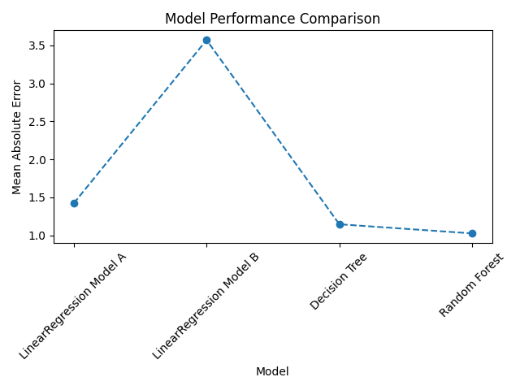
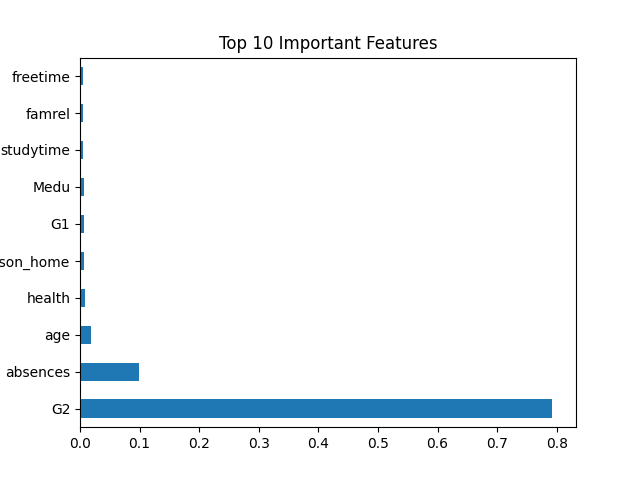

# Student Performance Prediction

## Overview

This project uses machine learning to predict a student's final grade (G3) using demographic, family, lifestyle, and academic information.

The project investigates which factors influence student performance and compares multiple machine learning models to predict final grades.

---

## Dataset

The dataset contains information about secondary school students, including:

- Demographic information
- Family background
- Study habits
- Alcohol consumption
- School support
- Academic performance

Target Variable:

- **G3** (Final Grade)

---

## Project Workflow

### 1. Data Preprocessing

- Loaded and inspected the dataset
- Identified numerical and categorical features
- Applied OneHotEncoder to categorical variables
- Split data into training and validation sets

### 2. Feature Engineering

Two approaches were tested:

- Using all available features including G1 and G2
- Removing G1 and G2 to evaluate the impact of previous grades

### 3. Machine Learning Models

The following models were trained and evaluated:

- Linear Regression
- Decision Tree Regressor
- Random Forest Regressor

### 4. Model Evaluation

Models were evaluated using Mean Absolute Error (MAE).

Lower MAE indicates better predictive performance.

---

## Results

| Model                               | MAE  |
| ----------------------------------- | ---- |
| Random Forest Regressor             | 1.02 |
| Decision Tree Regressor             | 1.15 |
| Linear Regression (with G1 & G2)    | 1.42 |
| Linear Regression (without G1 & G2) | 3.57 |

The Random Forest Regressor achieved the lowest Mean Absolute Error (MAE) and was selected as the final model.

---

## Key Findings

- G2 (second-period grade) was by far the most important predictor of final grade.
- Student absences were the second most influential feature.
- Random Forest achieved the best performance with an MAE of 1.02.
- Removing G1 and G2 increased MAE from 1.42 to 3.57, demonstrating the importance of previous academic performance.

---

## Technologies Used

- Python
- Pandas
- NumPy
- Matplotlib
- Scikit-learn

---

## Visualizations

### Model Comparison

### Feature Importance

---

## Author

**Smarth Kothari**
